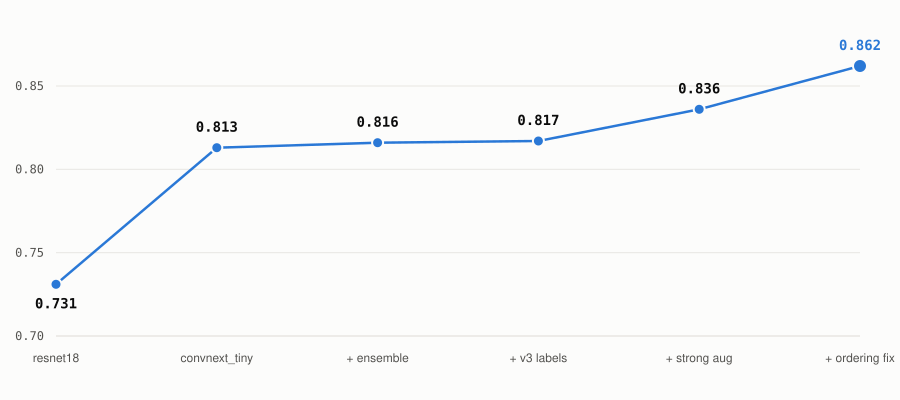
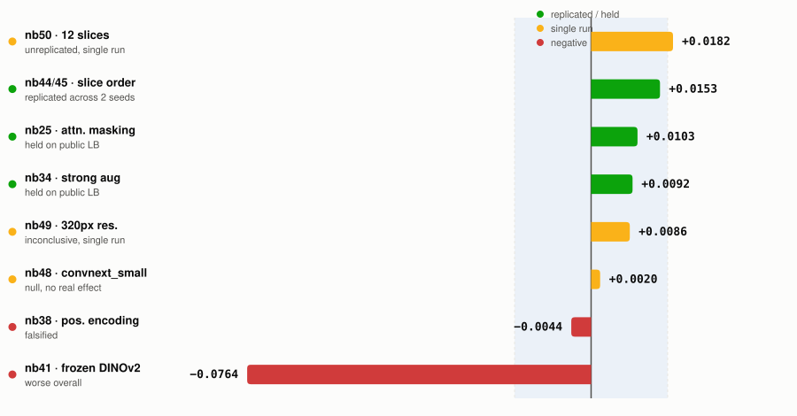

# Knee MRI Noise Floor

**[Live page →](https://knee-mri-noise-floor.vercel.app/)**

A research log from [Kaggle's RSNA Knee Abnormality Detection](https://www.kaggle.com/competitions/rsna-knee-abnormality-detection) competition — Efficiency Track, which scores accuracy achieved per unit of compute rather than accuracy alone. Fifty-one experiments, most of which proved nothing. This documents the measurement discipline that made that visible, and a DICOM slice-ordering bug that quietly invalidated two days of conclusions before anyone thought to check it.

Every number below comes from an actual notebook log or the Kaggle leaderboard. None are estimated.

## The task

Twelve binary diagnoses per knee MRI study — ACL and meniscus tears, arthritis across three compartments, effusion, fracture, and others — scored as macro-averaged ROC-AUC. 4,407 training studies, but only **58 carry expert image-read labels**. The other 4,349 have labels that have to be derived from free-text radiology reports written across nine languages. Two problems stacked on each other: teach a model to read knees, and first invent the labels to teach it with.

The 58 gold studies are also the only honest validation set — which is a very small number to measure against, and nearly every mistake in this log traces back to forgetting that.

## Where it stands

<picture>
  <source media="(prefers-color-scheme: dark)" srcset="assets/leaderboard-dark.svg">
  
</picture>

Three submissions in the middle moved the score by 0.004 combined. The two jumps that mattered were an architecture change (resnet18 → convnext_tiny) and the slice-ordering fix below, confirmed on the actual hidden test set — not just the 58-study local holdout.

## Discovering the noise floor

Two notebooks ran what was supposed to be the same configuration. One scored **0.8333**. The control scored **0.8164**. Same architecture, same data, same recipe — a gap of **0.017** from randomness alone.

That number is the most useful thing this project produced, because it retroactively demolished a lot of earlier work. Ten experiments had moved the score by less than 0.017 and been recorded as findings. They were not findings. They were coin flips written down as evidence.

From that point on, every comparison ran as a **paired test**: both arms in one process, same seed, same seeded batch-order generator, so the only difference is the variable under test. A result that doesn't clear 0.017 gets reported as inconclusive, no matter how convenient it would be to believe it.

## The bug hiding under the null results

An ablation reversed the order of sagittal slices, expecting the medial and lateral meniscus scores to move. The measured change was 0.0021 — nothing. Conclusion at the time: the architecture cannot perceive slice order.

Built on that conclusion, the next experiment added learned positional encodings to tell the model where each slice sat. It cost 0.0044. Recorded as a clean falsification. Roughly three GPU-hours spent.

Both conclusions were wrong, for the same reason. DICOM filenames are SOP Instance UIDs — assigned for uniqueness, not sequence. Every cache in the project had been sorted by filename, which produces an order uncorrelated with anatomy. Measured across 120 sampled series: **median rank correlation with true anatomical position was 0.111**, and not one series was correctly ordered.

The fix reads the geometry the DICOM headers already carry: `ImageOrientationPatient` gives the row/column direction cosines, their cross product is the slice normal, and projecting `ImagePositionPatient` onto that normal gives each slice's true position along the stack.

> A null result on an ablation should first raise the question of whether there was anything there to ablate. Reversing a random sequence yields another random sequence — the evidence for the bug was sitting inside the first null result, two days before anyone read it that way.

## What survived replication

<picture>
  <source media="(prefers-color-scheme: dark)" srcset="assets/noise-floor-dark.svg">
  
</picture>

Only the slice-ordering fix was tested twice. Its two seeds landed within 0.0005 of each other — the replication, not either single number, is what makes it credible. The macro average also hides the most interesting result: **Lateral Meniscus** had been stuck between 0.665 and 0.677 across every architecture tried all session. After the fix it moved to 0.815 and 0.800 on the two seeds — roughly nine times any other target's movement.

| Experiment | Change tested | Δ macro AUC | Verdict |
|---|---|---:|---|
| nb44 / nb45 | Anatomical slice ordering | +0.0150 / +0.0155 | **replicated** |
| nb50 | 12 slices per view | +0.0182 | unreplicated |
| nb49 | 320px input resolution | +0.0086 | inconclusive |
| nb48 | convnext_small (50M params) | +0.0020 | null |
| nb36 | Sagittal order reversal | +0.0021 | confounded (broken cache) |
| nb38 | Learned positional encoding | −0.0044 | falsified |
| nb41 | Frozen DINOv2 backbone | −0.0764 | worse overall |
| nb34 | Strong augmentation + view dropout | +0.0092 | held on LB |
| nb25 | Attention masking for empty views | +0.0103 | held on LB |

## Building labels that didn't exist

With 4,349 studies labelled only by free-text reports in nine languages, the labels themselves became a modelling problem:

| Method | Agreement with expert reads |
|---|---:|
| regex extraction | 0.804 |
| Qwen3-4B | 0.829 |
| Qwen3-8B | 0.844 |
| + ensemble | 0.857 |
| + vision out-of-fold co-training | **0.905** |

The useful finding: diversity beat capability. Doubling model size bought +0.015; adding a *differently wrong* extractor bought +0.031. The uncomfortable epilogue — pushing label quality from 0.857 to 0.905 moved the trained model by less than the noise floor. The model was never label-limited.

## Stack

PyTorch · timm (ConvNeXt) · pydicom · NumPy / pandas
Qwen3-4B & 8B, run offline inside Kaggle for report labelling
All training on Kaggle T4×2, ~30 GPU-hours/week

## Attribution

The implementation — training loops, preprocessing, the ordering fix, the label pipeline — was written by an AI coding agent (Claude Code) working under direction across the underlying notebooks. Direction, strategy, and result review were mine: choosing the Efficiency Track over the main board, deciding what to test next, reading results, and pushing back when a claim outran its evidence.

## Deploy

Static file, deployed on Vercel directly from this repo. `index.html` exists specifically so the domain root resolves — Vercel serves it by default at `/`.
